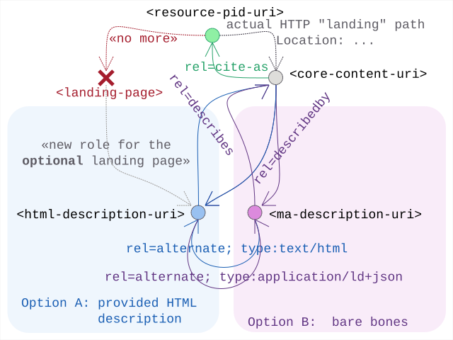

# Linkset Usage Pattern: No Landing (intermediate) Page Solution

## Pattern Name

[No Landing Page Solution][RT-P04]


## Goal

To enable machine-actionability and identity persistence for digital resources without requiring a dedicated intermediate HTML landing page. 

This ensures agents can navigate the resource graph regardless of the representation format retrieved. It introduces a subtle re-alignment in the navigation processes from content vs metadata interactions between humans and robots. As such it actually re-affirms the role of the user-agent as a robot itself with a clear human-assisting role. 

Finally, this replaces the expectations on server side implementation: they no longer need to include (custom) visual design and experience flows into these intermediate HTML landing pages, in stead they can just and assume client side plugins to visualise the provided affordances.


## Motivation


In the current web landscape, persistent identifiers (PIDs) like DOIs typically get resolved on the web, leading (via redirection) to a so called HTML landing page, not to the core content or artifact the identifier is actually representing. 

This landing page functions as an intermediate gateway. Its layout and affordances depend on the implementation provided, but generally offers a combination of these:

* mentioning the core persistent identifier for citations
* highlighting core metadata information (autor, title, owner, license, ...)
* share navigation paths to associated metadata records in various models, or services that visualize them
* including providing the actual artifact/content download link

Historically, this human-centric solution has proven its practical use and matured into common practice. It does however create several issues when we consider machine agents:

* The Extra Hop: The Machines must perform additional requests and scrape HTML to find the actual data. Something human end users have grown into unquestioned habit, compensated by the extra features the landing page is providing.
* The "Broken Chain": Conversely, if an agent reaches the actual content directly, it often loses the context of the PID and associated metadata.
* Human-Centric Bias: Documented usage patterns (like FAIR Signposting) treat the landing page habit as a mandatory reality. This confusion between materialisation and conceptualisation prohibits alternative approaches where open exposure of the information in a machine actionable way leads to reproduce the same (or more) functional affordances to the end-user.

This linkset usage pattern proposes that the various link-targets (from the PID resolving link, to the available metadata descriptions, and the actual content-download link) can all play an independent and equal role as entry point. By including discovery links (in linksets) in the HTTP headers for each of them, we ensure that the core information locked in landing-page-HTML is accessible via each of them. 

This allows to still provide human-readable interfaces, but repositioned to (just) one of many available descriptions (Option A). Having them at all gets demoted from requirement to questionable option as the affordances they hold can be generated on-the-fly by browser-plugins (Option B).


## Relations to other patterns

There is possible confusion or overlap with [RT-P03]. This comes from the fact that from a conceptual view-point there is only real world actual thing (the digital core asset) unambiguously referenced to with one persistent identifier (its `<resource-pid-uri>`). From this viewpoint one might consider meta-data records for that thing to be delivered through content-negotiation on the same resource. In this case a `rel=alternate` approach from [RT-PO3] offers a natural match, as the `rel=describedby` guidance is never needed to grab that information.

In most practical cases though, the persistent identifier used in citations is resolved by external services that simply provide a redirect. These are distinct from some primary catalogue services publishing distinct metadata-resources describing them; in turn often distinct from the archives that offer downloadable resources for the actual core content. In these cases the extra `rel=describedby` and `rel=describes` from this pattern [RT-P04] come into view. Weaving in pattern [RT-P03] for different variants of any these resources keeps the roles clear and obvious.

## Encoding 

In this approach, a specific representation of the core content being identified is designated to function as the primary resolution (i.e. where one "lands") for both human and machine agents.
This will typically be the HTML variant in common browser usage, but is obviously negotiable as in [RT-P03].  The content thus functions as the prime landing-target.

The PID connects to the final content-location via practical resolving and possible redirects. 
The link-back is ensured through a clear typed link-relation from that resulting anchor:

```
Link: <resource-pid-uri>; rel=cite-as
```

This usage is fitting the intentions and ideas of the [FAIR-signposting 'Identifier' pattern](https://signposting.org/patterns/identifier/)


Architects may still choose between two primary design options to fit this pattern.

### Option (a) - Keep providing a describing HTML Variant (repurposing the current "Landing Page") 

In this approach, the existing HTML page describing the identified content is repurposed and linked to/from the actual content-url.

```
# from the <core-content-uri> as anchor
Link: <html-description-uri>; rel=describedby; type: text/html
```

```
# from this <html-description-uri> as anchor
Link: <core-content-uri>; rel=describes
```

This should be seen as an optional server-provided human-oriented view that describes and offers essential navigation and features concerning the actual identified resource.

Note that, this option, still allows to provide (recommended) some machine-actionable description variant, possibly through an embedded HTML `<script type="application=ld+json">` tag.


### Option (b) - Only provide a core semantic model description, leaving human-centric description rendering to browser-plugin

In this approach, the resource description is provided in a machine actionable format (or multiple ones).

The clear human-vs-machine equivalence of the descriptive role of these resources is achieved through the exact same typed link relations:


```
# from the <core-content-uri> as anchor
Link: <ma-description-uri>; rel=describedby; type: application/ld+json
```

```
# from this <ma-description-uri> as anchor
Link: <core-content-uri>; rel=describes
```


### Option - Serve both human and machine-ready descriptions

Of course, both options can be combined.

In that case, fitting the [RT-P03] pattern, the alternative description formats should refer each other as `rel=alternate` variants. Each of which could additionally declare hints about `type=` and `profile=`


## Sketch

  
*Sketch of the linkset-usage-pattern for content-direct access with no landing-page-intermediate* 


## Link Relations Used

The following link relations are mandated for declaring the machine-readable links between digital assets and their available metadata descriptions without the strict need of optional human centric (HTML) descriptive pages:

| Relation Type	| Specification Source	| Technical Function | 
| ------------- | ----------------------| ------------------ |
| rel="cite-as"	| [RFC 8574 - cite-as link relation][RFC 8574] | Conveys a Preferred URI for Referencing the core digital asset in this pattern.
| rel="describedby"	| [W3C Protocol for Web Description Resources][powder-dr] | Connects the resource directly to its metadata descriptions (human or machine-actionable), effectively turning the former "landing page" into just another descriptive variant.


See [IANA Link relations][IANA relreg]


## Implementation Example: MarineInfo Case Study

This example demonstrates a machine agent requesting a Marine Research dataset by its doi. The web resolving of that lands on the core data made available, providing links to the correct cite-as (pid) and the available description formats


* DOI for the dataset: https://doi.org/10.14284/170
* DataSet content URI: https://www.marinespecies.org/aphia.php?p=search
* Dataset description URI: https://marineinfo.org/id/dataset/1447
* Dataset description Turtle Variant: https://marineinfo.org/id/dataset/1477.ttl
* Linkset (Variant Menu): https://marineinfo.org/id/dataset/1477-ls.json


All mentioned links refer to the last one as their local webmap of interconnected, related resources through this header in the HTTP-Response:

```
Link: <https://marineinfo.org/id/dataset/1447-ls.json>; rel=linkset
``` 

That linkset's content in turn describes the various uri in this pattern and their relative roles:
Note how this also blends in the usage of [RT-P03]

```
{ "linkset":
  [
    { "anchor"       : "https://marineinfo.org/id/dataset/1447",
      "describes"    : [ {"href": "https://marine-data-archive.org/data/39475-02348590-2234.csv" }],
      "alternate"    : [
        {"href"        : "https://marineinfo.org/id/institute/1447.ttl",
         "type"        : "text/turtle; charset=utf-8"
        },
        {"href"        : "https://marineinfo.org/id/institute/1447.jsonld",
         "type"        : "application/ld+json"
        },
        {"href"        : "https://marineinfo.org/id/institute/1447.html",
         "type"        : "text/html; charset=utf-8"
        }
      ]
    },
    { "anchor"       : "https://marine-data-archive.org/data/39475-02348590-2234.csv",
      "describedby"  : [ {"href": "https://marineinfo.org/id/dataset/1447"} ]
      "cite-as"      : [ {"href": "https://doi.org/10.14284/170"} ]
    }, 
    { "anchor"       : "https://marineinfo.org/id/institute/1447.ttl",
      "self"         : [ {"href": "https://marineinfo.org/id/institute/1447"} ]
    }, 
    { "anchor"       : "https://marineinfo.org/id/institute/1447.jsonld",
      "self"         : [ {"href": "https://marineinfo.org/id/institute/1447"} ]
    }, 
    { "anchor"       : "https://marineinfo.org/id/institute/1447.html",
      "self"         : [ {"href": "https://marineinfo.org/id/institute/1447"} ]
    }
  ]
} 
```


The first link (the DOI resolving one) can be configured to actually land at any of the other ones. 
This pattern suggests, from those choices, the core content URI is actually a rather great place to land.


## Additional considerations


### The confusion about the primary use scenario.

While there are different web-addresses at play in this scenario, all of them essentially gravitate around one central one at the core: a published digital asset. It is clear for all that it is identified clearly by the distinctive doi. This shared clarity includes answers to "What in essence this digital asset actually is" or "What its identifier is actually referring to".

Still, current doi-resolving practice obfuscates this clarity: we land not on the thing, but on a descriptive page of the thing. This feels like going to the library for a certain book, and ending up returning home with the index-registry card about it. Not precisely a useful or satisfying experience, is it?

And the introduced confusion has important unneeded side-effects: 

First, the browser experience introduces the landing page as a substitute for the actual digital asset. So much so that people end up questioning if these representations of the [metadata records actually need separate PIDs?](https://pidforum.org/t/do-metadata-records-need-separate-pids/2115). 

Secondly, the selected metadata model represented on these landing pages leads people to believe it is "the" (only) metadata to consider. The reality is very different. 

We argue there really is a primary case for accessing a digital asset: to anyone's spontaneous expectation it is about getting a copy of it. As in: "Go to the library, return with the book."
Next to that there is a limitless amount of secondary cases one could consider, each of them introducing the need for a different set (model) of associated information (metadata). The linkset pattern we introduce here precisely recalibrates for this two insights: dereferencing a doi should land on the content, the linkset allows to inform the consumer of the many available associated information models.  Each of these declared associated links could be annotated with content-types, profile-declarations and variant-menus (like in [RT-P01] and [RT-P03]) to help clients navigate and select the one they need.


### Landing Page Pattern considered Harmful

The important [FAIR-signposting](https://signposting.org/FAIR/) profile is a clear inspiration for this pattern.

Both follow the same conceptual semantics behind the used link-relations. Still, we believe this "no landing page" variation represents an important extension. This comes with some obvious critique: a lack of imagination towards changing current practices, manifested through the continued affirmed central role of the "landing page".

In software design and modelling it is considered an anti-pattern during analysis to be modelling the solution one is trying to replace. Something that is captured in the quote attributed to [Rich Hickey](https://download.clojure.org/presentations/DesignInPractice.pdf) "Model the problem, not the solution". This is precisely what this is about.

The power of using web-linking and linksets enable us to reconsider our current addiction to metadata-record-like landing pages. Rather than re-instantiating them as a material necessity, they can be replaced by declarative statements.  On top of those, the useful affordances these pages are offering can simply "emerge": be rendered by user agents and digital assistents. This solution path has the additional benefit of reducing the server side effort and increasing client-side context-aware relevance.


[RFC 8574]: https://www.rfc-editor.org/info/rfc8574                             "RFC 8574 cite-as link relation"
[IANA relreg]: https://www.iana.org/assignments/link-relations/                    "IANA register of Link Relations"
[powder-dr]: https://www.w3.org/TR/powder-dr/                                    "Protocol for Web Description Resources (POWDER): Description Resources"
[RT-P01]: ./01-profile-declaration.md                                         "Profile Declaration"
[RT-P03]: ./03-content-negotiation-menu.md                                    "Content Negotiation Menu"
[RT-P04]: ./04-no-landing-page-solution.md                                    "No Landing Page Solution"
