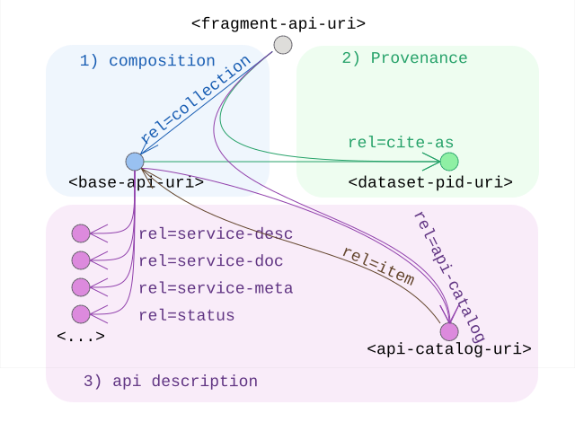

# Linkset Usage Pattern: Subsetting API

## Pattern Name

[Subsetting API][RT-P05]

## Goal

The primary objective of the [RT-P05] pattern is to establish a rigorous framework for "anchoring" a data fragment or subset URI back to its two foundational parents: the conceptual dataset (the "what") and the API base/service provider (the "how"). In the context of "Radical Transparency," a URI that delivers a specific search result or filtered slice must not exist in isolation, but link up to its related resources in an understandable way.

By mandating explicit, machine-readable links, this pattern mitigates Semantic Drift: the phenomenon where a data fragment loses its context, licensing, and provenance as it moves through a distributed system. Anchoring ensures that the Context IRI (the fragment) is inextricably bound to Target IRIs representing the broader dataset and the service contract, even if this IRI moves into detached media: a saved bookmark, or a shared link via chat or email or bookmark. 

This is a technical prerequisite for automated interoperability, allowing humans and machine agents alike to transition from a specific data slice to the full administrative and technical context required for valid processing.

## Motivation

Specifically, RT-P05 seeks to avoid resp. achieve these two 'states':

* The Broken Chain: This represents a failure state where a subset URI (e.g., a complex search result) provides data but lacks machine-readable pointers to its origin. Without these links, an automated agent cannot determine the parent dataset's license, find the API's technical capabilities (e.g. OpenAPI), or verify the data's persistent identity. This forces AI agents and bots into "statistical guesswork," leading to late unpleasant surprises, wasted time, unreliable interpretation of high-stakes information where the "implicit" context is lost, and increasingly also hallucination that can be avoided.

* Maximum Boredom (aka minimal surprise): This is the architectural preference for utilizing mature, standardized, and highly predictable IETF RFCs and OGC patterns. True interoperability is achieved when the discovery path is so standardized it becomes "boring" to the developer or bot. By relying on ubiquitous standards like RFC 8288 (Web Linking), the need for custom logic or proprietary integration is removed. The navigation from a fragment to its dataset or API definition becomes deterministic, predictable, and machine-actionable by design.

## Encoding 

Implementation requires exposing these relations through standard web-linking mechanisms. 

A standard response for a `<fragment-api-uri>` must include the `rel="collection"` link to the `<base-api-uri>` that identifies the webservice-API it is part of, typically this is the topmost URI of the service that functions as its entrypoint and is used as the core reference in any `api-catalog` as well as the anchor for further resources describing the API.

```
# from the original <fragment-api-uri> as anchor
Link: <base-api-uri>; rel=collection
```

In turn, the `<base-api-uri>` should include a `rel=cite-as` link to the PID of the dataset where the served fragments are actually derived from.

```
# from the <base-api-uri> as anchor
Link: <dataset-pid-uri>; rel=cite-as
```

Additionally the `<base-api-uri>` could also adhere to [RFC 9727], [RFC 8631] and our own [RT-P01]  leading to a more complete set of links, that can easily be encoded into one linkset, which can easily be connected to all `<fragment-base-uri>` as well:


```
# from any <**-api-uri> as anchor
Link: <core-api-linkset>; rel=linkset
```

which in turn holds:

```
{
  "linkset": [
    {
      "anchor": "<base-api-uri">
      "cite-as": [
        {"href": "<dataset-pid-uri>" }
      ],
      "api-catalog": [
        {"href": "/.well-know/api-catalog" }
      ],
      "service-desc": [
        {"href": "<machine-readable-api-description>"}
      ],
      "service-doc": [
        {"href": "<human-readable-service-documentation>"}
      ],
      "service-meta": [
        {"href": "<machine-readable-service-metadata>"}
      ],
      "status": [
        {"href": "<api-service-status-resource>"}
      ],
      "profile": [
        {"href": "<profile-uri>" } 
      ]
    }
  ]
}
```

### Note on search index optimisation and rel=canonical

As was the case with the previous pattern [RT-P03] a potential extra role can be played in this case by `rel=canonical` too.

Just like was the case there, this relation allows, in the context of search-engines to defer, and accumulate matching hits, from subresources to the central aggregatting source. In practice this means each of the subresources (or fragments) would forefeit having deeplinks to themselves presented in seach-engine results in favor of linking back to the api-endpoint, or more likely given the human-oriented use of this search-engines its UI.

It should be a careful consideration on the desired effect to actually apply this or not in any specific case.


## Sketch

  
*Sketch of the linkset-usage-pattern for subsetting apis*


## Link Relations Used

The following link relations are mandated for declaring the machine-readable links between the fragment-URI provided by subsetting services, their base-uri (aka service endpoint) and the core datasets they service.

| Relation Type	     | Specification Source	                            | Technical Function | 
| ------------------ | ------------------------------------------------ | ------------------ |
| rel="cite-as"	     | [RFC 8574 - cite-as link relation][RFC 8574]     | Provides a Persistent Identifier (PID) as in [RT-P02] for the actual dataset from which this fragment is derived. Removes the need for clients to guess the canonical reference for citation or further attached metadata like provenance, licensing, ... 
| rel="collection"   | [RFC 6573 - item/collection relations][RFC 6573] | Points from any fragment to the parent base-uri or entrypoint for the api. This base identifies the entity that would be listed in an api-catalog, and have further links to formal descriptions.


Additionally we recommend cataloging and describing the webservice api by blending in the link relations from [RFC 9727] and [RFC 8631]:

| Relation Type	     | Specification Source	                            | Technical Function | 
| ------------------ | ------------------------------------------------ | ------------------ |
| rel="api-catalog"  | [RFC 9727 - api-catalog][RFC 9727]               | Points to the service registry. Allows agents to discover the service's standing within a broader ecosystem without custom registry crawlers.
| rel="item"  	     | [RFC 9727 - api-catalog][RFC 9727]               | The actual api-catalog is encoded as a  linkset. In it the various API endpoints are listed as `rel=item`
| rel="service-desc" | [RFC 8631 - webservices link relations][RFC 8631]| Points to the API definition (e.g. OpenAPI). Enables deterministic discovery of the API contract, removing guesswork regarding endpoint structure or parameters.
| rel="service-doc"  | [RFC 8631 - webservices link relations][RFC 8631]| Points to API documentation that is primarily intended for human consumption.
| rel="service-meta" | [RFC 8631 - webservices link relations][RFC 8631]| Points to available metadata for the service context of the webservice API.
| rel="status" 	     | [RFC 8631 - webservices link relations][RFC 8631]| Points to resources providing status information (like availability, uptime, preformance, ...) of the API.


On top of this, we remind about earlier documented link-relation usage patterns in this series:

| Relation Type	     | Pattern	| Technical Function | 
| ------------------ | -------- | ------------------ |
| rel="profile"      | [RT-P01] | Provide conformance declaration of the web-api, allowing clients to calibrate expectations for further interactions.
| rel="describedby"  | [RT-P04] | Provide clear descriptions in various metadata models about the core dataset.
| rel="alternate"    | [RT-P03] | Provide clear menus of available variants of representations of resources, particularly provided fragments of the subset-api, or a resource describing either API or dataset.


See [IANA Link relations][IANA relreg]


## Implementation Example: MarineSpecies (WoRMS)

Applying the RT-P05 pattern to the World Register of Marine Species (WoRMS) demonstrates its utility in a production environment.

We consider for this example the functional "roles" of the various resources to be performed by the following actual URI:

| Functional role in the pattern | Actual URI in this example                                                                   |
| ------------------------------ | -------------------------------------------------------------------------------------------- | 
| `<dataset-pid-uri>`            | https://doi.org/10.14284/170                                                                 | 
| `<base-api-uri>`               | https://marinespecies.org/rest/                                                              |
| `<fragment-api-uri>`           | https://marinespecies.org/rest/AphiaRecordsByVernacular/horseshoe%20crab?like=true&offset=1  | 
| `<api-catalog>`                | https://marinespecies.org/.well-known/api-catalog                                            |
| `<base-api-linkset>`           | https://marinespecies.org/rest/api-linkset.json                                              |
| `<api-documentation>`          | https://marinespecies.org/rest                                                               |
| `<api-description>`            | https://marinespecies.org/rest/api-docs/openapi.yaml                                         | 


Applying the pattern straightforwardly simply means:

1. fragments are attached to their base, and for convenience directly to its linkset
1. that linkset connects them to the dataset, a catalog, and its descriptions via its linkset
1. a catalog is actually listing the service for discoverability

### API resources group up and provide a linkset

Any of these commands: 

```
curl -I https://marinespecies.org/rest/AphiaRecordsByVernacular/horseshoe%20crab?like=true&offset=1
curl -I https://marinespecies.org/rest/
```

Sample Header Output:

```
HTTP/1.1 200 OK
Link: <https://marinespecies.org/rest/>; rel=collection,
      <https://marinespecies.org/rest/api-linkset.json>; rel=linkset
```

### The linkset provides the core links describing the API and its provenance

Command: 

```
curl https://marinespecies.org/rest/api-linkset.json
```

Sample Output:

```
HTTP/1.1 200 OK
Content-type: application/linkset+json

{
  "linkset": [
    {
      "anchor": "https://marinespecies.org/rest/
      "cite-as": [
        {"href": "https://doi.org/10.14284/170" }
      ],
      "api-catalog": [
        {"href": "https://marinespecies.org/.well-know/api-catalog" }
      ],
      "service-desc": [
        {"href": "https://marinespecies.org/rest/api-docs/openapi.yaml",
         "type": "application/x-yaml}
      ],
      "service-doc": [
        {"href": "https://marinespecies.org/rest",
         "type": "text/html; encoding=UTF-8"}
      ],
      "profile": [
        {"href": "https://marinespecies.org/rest/api-profile"}
      ]
    }
  ]
}
```


### The API should be part of an api-catalog

Command: 

```
curl https://marinespecies.org/.well-known/api-catalog
```

Sample Output:

```
HTTP/1.1 200 OK
Content-type: application/linkset+json

{
  "linkset": [
    {
      "anchor": "https://marinespecies.org/.well-know/api-catalog",
      "item": [
        {"href": "https://marinespecies.org/rest/"} 
      ],

      ...
    }
  ]
}
```


[RFC 6573]: https://www.rfc-editor.org/info/rfc6573                             "RFC 6573 Item/Collection Relations"
[RFC 8574]: https://www.rfc-editor.org/info/rfc8574                             "RFC 8574 cite-as link relation"
[RFC 8631]: https://www.rfc-editor.org/info/rfc8631                             "RFC 8631 link relations for webservices"
[RFC 9727]: https://www.rfc-editor.org/info/rfc9727                             "RFC 9727 api-catalog"
[IANA relreg]: https://www.iana.org/assignments/link-relations/                    "IANA register of Link Relations"
[RT-P01]: ./01-profile-declaration.md                                         "Profile Declaration"
[RT-P02]: ./02-profile-composition.md                                         "Profile Composition"
[RT-P03]: ./03-content-negotiation-menu.md                                    "Content Negotiation Menu"
[RT-P04]: ./04-no-landing-page-solution.md                                    "No Landing Page Solution"
[RT-P05]: ./05-subsetting-api.md                                              "Subsetting API"
