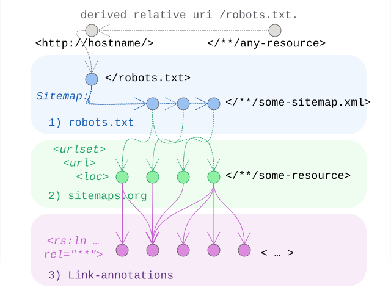

# Linkset Usage Pattern: Hostwide Resource Discovery

## Pattern Name

[Hostwide Resource Discovery][RT-P06]

## Goal

This pattern aims to provide an alternative way to discover and harvest available link-relations (possibly in linksets) on resources from a particular host. 

This allows for deployment solutions where content providers can leave static content to be served, but have no or limited control over the service stack to also influence HTTP-Header responses. Additionally it provides a catch-all starting point for cases where no single such point is naturally available. 

An extra sidewise goal is to attribute OAI's ResourceSync [resourcesync] specification given its important role in this set of patterns.

## Motivation

All patterns up to here work really well provided you have a URI to start with. They also assume one has enough control over the deployment environment to manipulate HTTP-headers in responses.

When one of the above is not easily met, this pattern offers to use existing web-infrastructure (namely robots.txt and sitemap.xml) to disclose relevant resources and apply classic XML-namespace syntax to mixin and annotate those links with exposed link-relations. 

## Relation to other patterns

Unlike the other patterns, this one does not really play into a specific usage scenario, concrete issue, or stereotypical resources-roles to be captured and expressed via the correct `rel=...` combinations. Instead it adds a practical implementation path to provide these link-relations and have them discovered or harvested.

[RT-P07] provides a concrete usage of these to expose catalogs on a host-level.


## Existing use and variants

The technique we describe here is borrowed from (and documented by) important other players. We have however encountered two distinct implementation alternatives.

### Google and Adobe: back to xhtml links

The first encountered technique for this relies on the inclusion of this namespace:
```
xmlns:xhtml="http://www.w3.org/1999/xhtml"
```

This approach is not a theoretical proposal but a reflection of established web-crawling practices. Large-scale publishers like Google (e.g., for Gmail sitemaps) and Adobe have long used XHTML link injections within the Sitemap protocol to signal localized variants or related resources. 

For a formal reference on the base protocol, see [Sitemaps.org][sitemaps-org].

For specific examples and documentation showing and advocating the `xhtml:link` mixin we refer to:

* [Google's gmail sitemap](https://www.google.com/gmail/sitemap.xml)
* [Adobe's home sitemap](https://www.adobe.com/home-sitemap.xml)
* [Google's developer docs](https://developers.google.com/search/docs/specialty/international/localized-versions#example_2)

The use of `xhtml:link` within a sitemap brings the web-linking model full circle. While RFC 8288 [RFC 8288][rfc8288] provides the formal model for externalizing links from the HTML payload into the HTTP header, it fundamentally encodes the same relationship logic originally introduced by HTML `<link>` tags. By using the xhtml namespace, we maintain a consistent serialization path: from HTML tags to XML-embedded links, all while adhering to the same semantic registry defined by IANA.


### Signposting.org: signmaps

The alternative is using this namespace:
```
xmlns:rs="http://www.openarchives.org/rs/terms/"
```

This alternative follows the ResourceSync Framework Specification (ANSI/NISO Z39.99-2017) [resourcesync], which introduced the <rs:ln> element specifically to extend Sitemaps with the capacity to discover related resources, metadata, and bitstream fixity. By using this dedicated `rs` namespace, this approach allows for a richer set of attributes (such as hash and modified) that are absent from the standard XHTML link model but essential for automated data synchronization.

This exactly matches signposting's signmaps approach. [signmaps]

### Formal Alignment: ResourceSync as the Foundation 

To ensure maximum interoperability within the scholarly and scientific web, [RT-P06] adopts the ResourceSync Framework Specification (ANSI/NISO Z39.99-2017) [ResourceSync] as its formal base. While common web-crawlers (Google, Adobe) have historically used `<xhtml:link>` injections in sitemaps for localized variants, the `<rs:ln>` element from ResourceSync provides a more robust, validated, and machine-actionable trajectory.

In accordance with Postel's Law—"be conservative in what you do, be liberal in what you accept from others" ([RFC 1122][RFC 1122]—, providers adhering to Radical Transparency SHOULD be conservative in their output by strictly employing the rs namespace (xmlns:rs="http://www.openarchives.org/rs/terms/") and the `<rs:ln>` element. This ensures that generated sitemaps are verifiable against the formal [ResourceSync XSD][rs-ln-xsd]. Conversely, consumers MUST be liberal in what they accept, supporting both rs:ln and the widely encountered xhtml:link variants to ensure compatibility with broader web practices.


## Encoding 

To implement this pattern, the server MUST:

1. Include the XHTML namespace declaration in the root `<urlset>` element: `xmlns:rs="http://www.openarchives.org/rs/terms/"`.
2. Within each `<url>` block, following the mandatory `<loc>` element, include one or more `<rs:ln>` elements.
3. Each link MUST contain a rel attribute and an href attribute pointing to the target resource (e.g., a profile or a linkset).

In general, through the use of external xml namespace, these additions to the `sitemap.xml` can simply be ignored by robots that are unware of their use and semantics. Robots that are aware, can apply the additional information to optimise their working.

### Strategic focus to the minimal 

While the Sitemap protocol allows for a wide range of XML injections, Radical Transparency recommends a minimal approach for host-wide discovery. To keep sitemaps "lean and mean," providers SHOULD limit annotations to these primary link relations:

1. `rel=profile`: To allow harvesters to immediately identify the type and conformity of a resource.
2. `rel=linkset`: To provide the navigation map that documents all other semantic connections of the resource.  (e.g. content negotiation menus from RT-P03 or provenance chains from RT-P05)
3. `rel=api-catalog`: This is actually a special case of the above as api-catalogs are essentially linksets.

To be clear: we see no absolute value to move or copy all the resource level details captured in the linksets into the sitemap. By offloading granular interaction details to dedicated linkset files ([RFC 9264][RFC 9264]), we ensure that the sitemap remains a high-performance index rather than a bloated metadata store. It should be equally clear that the application of this pattern in any way excludes the encoding of more information relations into the signmaps, even if that is duplicating existing linksets. Depending on how certain service deployments are setup and consumed, the balancing act of providing more information in less requests becomes an optimisation task. The kind of engineering that is not affecting nor constraind by the conceptual model. 

This strategic choice also marks the boundary between [RT-P06] and [RT-P07]. In the latter, we are going to group resources further into domain-specific catalogues (like DCAT or API-Catalogs); it explores how these specialized registries and harvesting APIs augment the standard indexing role for robots.


## Sketch

  
*Sketch of the linkset-usage-pattern for hostwide discovery of resources*


## Link Relations Used

Unlike other RT patterns, [RT-P06] does not mandate a specific set of link relations. Instead, it functions as a transport container for any relation type defined in other patterns (such as `rel="profile"` from [RT-P01] or `rel="linkset"` and `rel="variant"` from [RT-P03]).


## Implementation Example: MarineInfo 

Projecting the Content Negotiation Menu into a Sitemap.


To demonstrate the utility of [RT-P06], we revisit the MarineInfo.org case study applied in [RT-P03]. There we detailed how a conceptual URI provides a "Menu of Variants" via HTTP headers or linksets. Here, we project how these available linksets can easily be disclosed to harvesters via the domain's Signmap. No additional resource level requests are needed to discover these.

Instead of listing every alternative representation (JSON-LD, Turtle, HTML), the sitemap only exposes the Linkset relation. A bot harvesting the domain can now learn about the conceptual list of core resources, and learn that linksets for them are present, rather than be flooded with the detail of individual representation variants.

```xml
<?xml version="1.0" encoding="UTF-8"?>
<urlset xmlns="http://www.sitemaps.org/schemas/sitemap/0.9"
        xmlns:rs="http://www.openarchives.org/rs/terms/">
  <!-- Entry for Institute 36 -->
  <url>
    <loc>https://marineinfo.org/id/institute/36</loc>
    <!-- Minimal: Linkset discovery for this resource -->
    <rs:ln rel="linkset" 
           href="https://marineinfo.org/id/institute/36-ls.json" 
           type="application/linkset+json" />
    <!-- Optional: Exposure of alternative representations inline -->
    <rs:ln rel="alternate" 
           href="https://marineinfo.org/id/institute/36.ttl" 
           type="text/turtle" />
    <rs:ln rel="alternate" 
           href="https://marineinfo.org/id/institute/36.jsonld" 
           type="application/ld+json" />
    <rs:ln rel="alternate" 
           href="https://marineinfo.org/id/institute/36.html" 
           type="text/html" />
  </url>
</urlset>
```

[RFC 1122]: https://www.rfc-editor.org/info/rfc1122                             "RFC 1122 Requirements for Internet Hosts -- Communication Layers"
[RFC 8288]: https://www.rfc-editor.org/info/rfc8288                             "RFC 8288 Web Linking"
[RFC 9264]: https://www.rfc-editor.org/info/rfc9264                             "RFC 9264 Linksets"
[signmaps]: https://signposting.org/Signmap/                                    "An inventory technique for Signposting"
[resourcesync]: https://www.openarchives.org/rs/1.1/resourcesync                    "The ResourceSync Framework Specification"
[rs-ln-xsd]: https://www.openarchives.org/rs/1.1/resourcesync.xsd                "XML Schema for the resource-sync namespace"
[sitemaps-org]: https://www.sitemaps.org/protocol.html                              "The Sitemaps protocol"
[RT-P01]: ./01-profile-declaration.md                                         "Profile Declaration"
[RT-P03]: ./03-content-negotiation-menu.md                                    "Content Negotiation Menu"
[RT-P06]: ./06-hostwide-discovery.md                                          "Hostwide Resource Discovery"
[RT-P07]: ./07-catalog-assistance.md                                          "Catalog Listing to Assist Hostwide Discovery"
