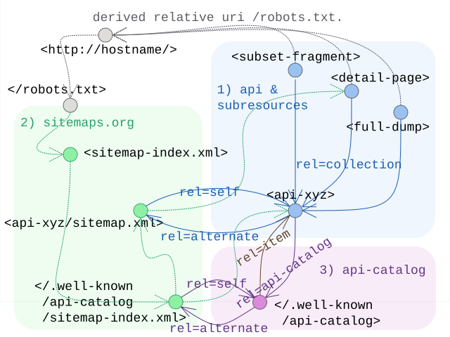

# Linkset Usage Pattern: Catalogue Assisted Resource Exposure

## Pattern Name

[Catalogue Assisted Resource Exposure][RT-P07]

## Goal

The objective of this pattern is to delegate the granular exposure and discovery of digital assets to specialized catalogs, registers, or stream-based interfaces (such as DCAT, OGC API - Records, Subsetting API services, or dedicated harvesting services). By marking these catalogs as authoritative entry points within the host-wide discovery layer ([RT-P06]), providers can ensure that machine agents find the most efficient path to harvest or search large-scale collections without overwhelming static sitemaps.

## Motivation

The pattern for host-wide discovery [(RT-P06)][RT-P06] offer a simple and straightforward approach to mixin link-relation annotations into sitemaps. However, real-life service deployments make us additionally consider scaling challenges, typical hierarchy of resourcetypes and varying needs or goals for crawler activities or search-engine indexing:

* Scalability Limits: The Sitemap protocol is capped at 50,000 entries per file (or 50MB per file, if the average size per entry exceeds 1KB). This is insufficient for domains hosting millions of records or dynamic subsets. The sitemap protocol offers a hierarchical index file to mediate this limit, but offers no further application advise in mapping that to the common APIs that typically assist in such large scale publication of resources.
* Search vs. Crawl: Large collections often require query-based access (e.g., spatial filters in STAC or OGC Records) rather than linear crawling.
* Bot Efficiency: Specialized catalogs provide richer metadata "hints" (profiles) that allow bots to skip irrelevant sub-collections early in the discovery process.
* The Balancing Act: This pattern allows architects to choose the "optimal bucket" for their data. If a domain lacks a Subsetting API (RT-P05), it may keep more detail in the sitemap. Conversely, the presence of a robust API-Catalog (RFC 9727) allows the sitemap to remain "lean and mean" by simply pointing to the catalog's root.

### The digital ecosystem hierarchy

Modern data providers do not serve a flat list of files; they manage a complex hierarchy of digital assets. To navigate this effectively, machine agents must distinguish between various resource roles:

* **Entry Points**: Static landing pages or single-page application (SPA) frontends that serve human users.
* **Service Gateways**: API endpoints and catalog roots (e.g., OGC Records, STAC) that act as authoritative brokers for sub-collections.
* **Aggregated Assets**: Datasets and catalog dumps provided as bulk downloads for initial harvesting.
* **Granular Resources**: Individual records, metadata files ([RT-P04]), and dynamic data fragments ([RT-P05]).

To prevent crawlers from getting lost in this hierarchy, [RT-P07] utilizes the Sitemap Index hierarchy. Instead of a single massive file, providers use a sitemap-index.xml to delegate specific sub-domains of the host to dedicated sitemaps that can both list and serve as alternatives to catalogs or dedicated APIs. In combination with conformity declarations through [RT-P01] this structural "hand-over" ensures that a general web-bot finds the gateway, while a specialized harvester (like an LDES client) follows the rel="profile" link to initiate deep harvesting.


## Relation to other patterns

[RT-P07] does not exist in isolation; it functions as the structural glue between host-wide discovery and granular interaction:

* [RT-P06] Integration: It extends the host-wide discovery by specializing the sitemap entries. While P06 says "I have resources," P07 says "For these specific resources, consider using this specialist API."
* [RT-P01] Dependency: A machine agent relies on the `rel=profile` declaration within the sitemap to recognize that a URI is not just a page, but a catalog adhering to a known standard (like DCAT or OGC).
* [RT-P05] Connection: When a catalog exposes dynamic subsetting capabilities, it functions as a Subsetting API. RT-P07 provides the link to the service base, which in turn provides the `rel=collection` anchors for individual fragments.


Also, this approach alligns with the recommendations of the [ODIS Book](https://book.odis.org/gettingStarted.html#creating-a-sitemap) and taps into actual sitemap generation support that is already implemented in some subsetting-API systems.


## Encoding 

This pattern implements the "hand-over" from the general sitemap to the specialized catalog using the ResourceSync/Signmap extension elements (`rs:ln`). 

To do this, it introduces a sitemap-hierarchy that allows to mimic the 'collection' or 'containment' relation API-endpoints have to detailed resources they produce. This allows to treat these sitemaps as 'alternative' representations for those API-endpoints.  Applied to itself this approach suggests the well-known api-catalog itself, which is expected to list all local API-endpoints should also receive such sitemap.xml counterpart to be placed in the hierarchy.

To implement catalog-assisted exposure, providers MUST follow these rules:
* Bootstrap: provide a root sitemap-index conform to [sitemaps-org] 
* Catalog-of-Catalogs: an [RFC 9727] compatible `api-catalog` MUST be provided, and listed in the sitemap hierarchy, additionally its content SHOULD be reflected in a dedicated sitemap.xml alternate, which should also be referenced in the sitemap-hierarchy. The `<rs:nl>` should be uses to mark this resource with the `rel=api-catalog`
* Catalog Registration: Every authoritative catalog on the system SHOULD be listed in the above `api-catalog`, and CAN provide itself an alternate in sitemap.xml format.
* Mandatory Profiling: To enable machine-actionability, each entry SHOULD declare its conformity via `rel=profile` relations. In the various sitemap.xml these SHOULD be encoded through `<rs:ln>` elements.

### Design Considerations: The Balancing Act of Exposure

The boundary between host-wide sitemaps ([RT-P06]) and catalog-assisted exposure ([RT-P07]) is not a fixed architectural mandate but a strategic choice based on local service optimization. While specialized catalogs are superior for handling millions of dynamic records, sitemaps remain the "Maximum Boredom" path for general web-bots. 

When designing an exposure strategy, providers should consider the following: 

* Sitemaps as API Alternates: Following the logic of `rel=alternate`, a sitemap hierarchy can be viewed as a static, crawlable alternative to a searchable WebService API . This allows providers to support low-barrier harvesting for standard bots while reserving the API for complex, query-driven interactions.

* Crawl Optimization and Protection: To ensure service stability, architects may choose to expose all granular resources in a sitemap hierarchy while simultaneously applying `Disallow` directives in the `robots.txt` for the corresponding API endpoints (e.g., `Disallow: /api/v1/records/**`). This guides automated agents toward the pre-calculated sitemap index and away from resource-intensive search interfaces.

* Redundancy at the Meta-Level: Listing API gateways in both a sitemap and an [RFC 9727 api-catalog][RCFC 9727] is a deliberate choice of "Explorability" over exclusivity. The sitemap ensures the service is discoverable by general-purpose web crawlers, while the `api-catalog` provides a dedicated registry for agents specifically seeking technical contracts (OpenAPI) and service status.

* Delegation of Responsibility: The primary goal of [RT-P07] is to enable a "hand-over." Providers must decide if, and at what level of the hierarchy a general-purpose crawler should stop following sitemap links and start utilizing a specialized harvester (such as an LDES client or STAC crawler) based on the declared `rel=profile`.

## Sketch

  
*Sketch of the linkset-usage-pattern for catalog assisted discovery*


## Link Relations Used

| Relation Type | Specification | Technical Function | 
| :--- | :--- | :--- | 
| rel=api-catalog | [RFC 9727] | Identifies the resource as a formal registry of services or APIs. | 
| rel=profile | [RFC 6906] | Declares the standard the catalog adheres to (e.g., STAC, DCAT, OGC), allowing the harvester to select the correct driver. |
| rel=collection | [RFC 6573] |  As in [RT-P05] we link provided details and subsets back to the api-endpoint that produces them. | 
| rel=self | [RFC 4287] | As in [RT-P03] we link alternatives back to their core identifying resource. 
| rel=alternate | [RFC 6596]  | As in [RT-P03] we link to known alternative representations.


## Implementation Example: MarineInfo 

In this example, MarineInfo.org exposes its vast collection of records. Instead of listing every individual dataset in the main sitemap, it delegates to dedicated sub-sitemaps for the various types maintained on the system (As it proves our point we limit ourselves to expanding only one).
In the process it links to the alternative LDES harvesting protol endpoints that are provided for each of them. 
Finally these endpoints are also listed in the available api-catalog.


### Structural boilerplate

The starting point is the `/robots.txt` file

```txt 
# https://marineinfo.org/robots.txt

Sitemap: https://marineinfo.org/sitemap.xml
```

The central sitemap.xml delegates to one per type of exposed record, plus the one listing the api-catalog and ldes-api-endpoints.

```xml 
<?xml version="1.0" encoding="UTF-8"?>
<!-- https://marineinfo.org/sitemap.xml -->
<sitemapindex
    xmlns="http://www.sitemaps.org/schemas/sitemap/0.9"
    xmlns:rs="http://www.openarchives.org/rs/terms/"i
>
  <!-- First a specific sitemap works as alternate variant for the api-catalog -->
  <sitemap>
    <loc>https://marineinfo.org/.well-known/api-catalog/api-sitemap.xml</loc>
    <rs:ln rel="self" 
           href="http://marineinfo.org/.well-known/api-catalog" />
  </sitemap>
  <!-- The, for the various types: dataset, person, institute, ... we introduce sub-sitemaps 
     | These function, in turn, as alternatives for the provided (and better tuned) LDES harvesting endpoint.
     -->
  <sitemap><!-- for type dataset  -->
    <loc>https://marineinfo.org/sitemaps/dataset-sitemap.xml</loc>
    <rs:ln rel="self" 
           href="https://marineinfo.org/feed/dataset" />
    <rs:ln rel="api-catalog" 
           href="https://marineinfo.org/.well-known/api-catalog" />
  </sitemap>
  <sitemap>
    ... <!-- Repeated similarly for other types ... -->
  </sitemap>
</sitemapindex>
```

### The API-catalog 

The API-catalog lists all the known API endpoints.

```json
// https://marineinfo.org/.well-known/api-catalog
{
  "linkset": [
    {
      "anchor"   : "https://marineinfo.org/.well-know/api-catalog",
      "item"     : [ // the various different LDES feeds as api-endpoints listed:
        {"href": "https://marineinfo.org/feed/dataset"},
        {"href": "https://marineinfo.org/feed/person"},
        {"href": "https://marineinfo.org/feed/institute"},
        ... // repeated to list all feeds for the various types
      ],
      "alternate": [ // the sitemap alternative to retrieve all api-endpoints:
        {"href": "https://marineinfo.org/.well-known/api-catalog/api-sitemap.xml", 
         "type": "application/xml; profile=http://www.sitemaps.org/schemas/sitemap/0.9"}
      ] 
    }, 
    { // for each api-endpoint we can simply include its profile and descriptive links
      "anchor"   : "https://marineinfo.org/feed/dataset",
      "profile"  : [ // declare conformance of this endpoint to the LDES spec
        {"href": "https://w3id.org/ldes/specification" }
      ], 
      "alternate": [ // the sitemap alternative to retrieve all datasets:
        {"href": "https://marineinfo.org/.well-known/api-catalog/api-sitemap.xml", 
         "type": "application/xml; profile=http://www.sitemaps.org/schemas/sitemap/0.9"}
      ]
    }, 
    ... // repeated for the other types
  ]
}
```

This can mostly be repeated into the alternate variant in sitemap.xml format as a fallback to classic web-resouce harvesting.

```xml 
<!-- https://marineinfo.org/.well-known/api-catalog/api-sitemap.xml -->
<urlset 
    xmlns="http://www.sitemaps.org/schemas/sitemap/0.9"
    xmlns:rs="http://www.openarchives.org/rs/terms/"
>
  <url>
    <loc>https://marineinfo.org/feed/dataset</loc>
    <rs:ln rel="profile"
           href="https://w3id.org/ldes/specification">
  </url>
  <url>
    <loc>https://marineinfo.org/feed/person</loc>
    <rs:ln rel="profile"
           href="https://w3id.org/ldes/specification">
  </url>
  <url>
    <loc>https://marineinfo.org/feed/institute</loc>
    <rs:ln rel="profile"
           href="https://w3id.org/ldes/specification">
  </url>
  <url>
    ... <!-- Repeated similarly for other types ... -->
  </url>
<urlset>
```


### The LDES API 

Finally each API endpoint can play a similar game to 
1. use link relations to hook-up api-catalog and/or (optionally more elaborate) linksets 
2. provide a classic sitemap.xml alternate variant to harvest (some selection of) sub-resources.

For the link relation:

```bash
$ curl -LI --url "https://marineinfo.org/ldes/dataset"

HTTP/1.1 200 OK
Link: <./dataset-feed.ls.json>    # e.g. for RT-P03 conneg menu and RT-P05 subsetting api
      ; rel=linkset
Link: </.well-known/api-catalog>
      ; rel=api-catalog
Link: </sitemaps/dataset-sitemap.xml>
      ; rel=alternate
      ; type="application/xml; profile=http://www.sitemaps.org/schemas/sitemap/0.9"
...
```

For the sitemap alternative:
```xml
<!-- https://marineinfo.org/sitemaps/dataset-sitemap.xml -->
<urlset>
  <url>
    <loc>https://marineinfo.org/id/dataset/1</loc>
    <!-- RT-P03 conneg menu -->
    <rs:ln rel="linkset"  
           href="https://marineinfo.org/id/dataset/1.ls.json" >
    <!-- RT-P01 conformity declaration to semic's DCAT-AP -->
    <rs:ln rel="profile"  
           href="http://data.europa.eu/r5r/">
    <!-- strict rdfs:type like typing -->
    <rs:ln rel="type"  
           href="http://www.w3.org/ns/dcat#Dataset" >
  </url>
  <url>
    ... <!-- Repeated similarly for other instances of this type ... -->
  </url>
<urlset>
```


[RFC 4287]: https://www.rfc-editor.org/info/rfc4287                             "RFC 4287 The Atom Syndication Format"
[RFC 6573]: https://www.rfc-editor.org/info/rfc6573                             "RFC 6573 Item/Collection Relations"
[RFC 6596]: https://www.rfc-editor.org/info/rfc6596                             "RFC 6596 The Canonical Link Relation"
[RFC 6906]: https://www.rfc-editor.org/info/rfc6906                             "RFC 6906 The 'profile' Link Relation"
[RFC 9727]: https://www.rfc-editor.org/info/rfc9727                             "RFC 9727 api-catalog"
[sitemaps-org]: https://www.sitemaps.org/protocol.html                              "The Sitemaps protocol"
[RT-P01]: ./01-profile-declaration.md                                         "Profile Declaration"
[RT-P03]: ./03-content-negotiation-menu.md                                    "Content Negotiation Menu"
[RT-P04]: ./04-no-landing-page-solution.md                                    "No Landing Page Solution"
[RT-P05]: ./05-subsetting-api.md                                              "Subsetting API"
[RT-P06]: ./06-hostwide-discovery.md                                          "Hostwide Resource Discovery"
[RT-P07]: ./07-catalog-assistance.md                                          "Catalog Listing to Assist Hostwide Discovery"
