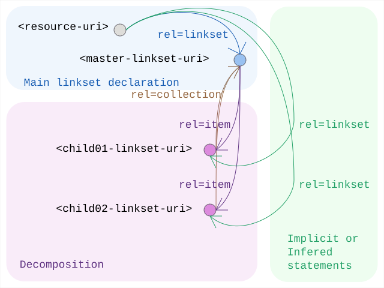

# Linkset Usage Pattern: Large Linkset Split-up

## Pattern Name

[Large Linkset Split-up][RT-P08]

## Goal

The objective of this pattern is to provide a standardized mechanism for decomposing large linksets into manageable, cacheable, and specialized fragments. By utilizing the `rel="item"` and `rel="collection"` relations, providers can split extensive discovery maps—driven by large catalogs, complex sitemaps, or the aggregation of multiple RT patterns—without losing the structural integrity of the resource’s "webmap."

## Motivation

While [RFC 9264 linksets][RFC 9264] solve the "bloated HTTP header" problem, the linkset documents themselves can become a bottleneck at scale. Key drivers for this pattern include:

* Predictability and Performance: Massive linksets (e.g., for global catalogs) can impact parser performance and memory usage on constrained machine agents.
* Cache Optimization: Splitting links by their change frequency (e.g., static profile links in one file, dynamic provenance links in another) allows for more efficient HTTP caching strategies.
* Separation of Concerns: A provider may wish to group links by their functional role (e.g., one child linkset for the Content Negotiation Menu of RT-P03 and another for the Subsetting API anchors of RT-P05). Additionally various resources might be playing different roles in different patterns: so linksets could naturally reflect individual patterns and get recombined depending on specific resources.
* Sync Efficiency: In large-scale deployments like ResourceSync or LDES, breaking down updates into smaller chunks reduces the payload size for each synchronization event.


## Relation to other patterns

This is a simple and stand-alone "architectural housekeeping" pattern. A direct application in fact of [RFC 6573], in particular to linksets [RFC 9264] themselves.

As such it simply serves as a reminder of a built-in engineering optimisation that might very well come in handy, precisely when eagerly adopting 'all these patterns' and its underlying Radical Transparency idea.

## Encoding 

Decomposition follows a hierarchical structure using the Item/Collection logic ([RFC 6573]):

1. Identity Anchor: The resource itself points to a Master Linkset using rel="linkset".
2. Downlink (Decomposition): Within the Master Linkset, additional fragments are linked using rel="item".
3. Uplink (Context): Each child linkset SHOULD include a rel="collection" link back to the Master Linkset to maintain the discovery context.
4. Implicit Statement Scope: Statements within a child linkset remain autonomous. When a machine agent encounters an item relation in a linkset, it SHOULD recursively harvest the target to complete its understanding of the anchor resource.


### Design Considerations: Target Attributes 

While [RFC 8288] is open to any key/value target attributes, it is limiting in its own standard set of target attributes (e.g., type, title, media) in [its 3.4 section](https://www.rfc-editor.org/info/rfc8288/#section-3.4), Radical Transparency encourages the use of extension attributes within linksets to guide machine agents. To optimize harvesting in [RT-P08], providers SHOULD consider adding:

* `last-modified={iso 8601 datetime}`: To allow agents to skip hitting unchanged child linksets.
* `change= {created|updated|deleted}`: (Inspired by [the changeType in ResourceSync](https://www.openarchives.org/rs/1.1/resourcesync.xsd)) to signal the nature of the update within a split-up stream.


## Sketch

  
*Sketch of the linkset-usage-pattern for large-linksets*


## Link Relations Used

 | Relation Type     | Specification | Technical Function | 
 | :---------------- | :------------ | :----------------- | 
 | rel="linkset"     | [RFC 9264]    | Points the initial resource to the primary navigation map (the Master). | 
 | rel="item"        | [RFC 6573]    | Signals that the target is a constituent fragment of the linkset, triggering recursive discovery. | 
 | rel="collection"  | [RFC 6573]    | Points back from a fragment to its parent/master linkset to provide context. |


## Implementation Example: Pattern Weaving & Functional Split-up

To demonstrate [RT-P08], we revisit some of the MarineInfo.org resources we mentioned in earlier patterns. As a provider adopts multiple Radical Transparency patterns, the number of link relations for a single resource grows: it needs to declare Conformity Profiles ([RT-P01]), expose a Content Negotiation Menu ([RT-P03]), and provide context for Subsetting APIs ([RT-P05]).
Instead of serving one monolithic linkset, MarineInfo uses a Master Linkset to delegate discovery based on functional roles. This ensures that a harvester interested only in "provenance" doesn't have to parse the entire "variants menu."

1. The Master Linkset (institute-36.ls.json) The master linkset acts as the "Identity Anchor." It contains the bootstrap links and delegates the rest to specialized child linksets using `rel="item"`.

```json
{
  "linkset": [
    {
      "anchor": "https://marineinfo.org/id/institute/36",
      "item": [
        { 
          "href": "https://marineinfo.org/id/institute/36/profiles.ls.json", 
          "type": "application/linkset+json",
          "title": "Conformity & Profile Declarations (RT-P01/P02)"
        },
        { 
          "href": "https://marineinfo.org/id/institute/36/variants.ls.json", 
          "type": "application/linkset+json",
          "title": "Content Negotiation Menu (RT-P03)"
        },
        { 
          "href": "https://marineinfo.org/id/institute/36/services.ls.json", 
          "type": "application/linkset+json",
          "title": "API & Subsetting Context (RT-P05/P07)"
        }
      ]
    }
  ]
}
```


2. Specialized Child Linksets 


Example: `profiles.ls.json` -- This fragment focuses exclusively on the "What is this?" question, containing the relations from [RT-P01] and [RT-P02].

```json
{
  "linkset": [
    {
      "anchor": "https://marineinfo.org/id/institute/36",
      "collection": { "href": "https://marineinfo.org/id/institute/36.ls.json" },
      "profile": [
        { "href": "https://marineinfo.org/profiles/institute" },
        { "href": "https://schema.org/Organization" }
      ]
    }
  ]
}
```

Example: `variants.ls.json` -- This fragment focuses on 'which variants do exist' as suggested in [RT-P03]

```json
{
  "linkset": [
    {
      "anchor": "https://marineinfo.org/id/institute/36",
      "collection": [
        { "href": "https://marineinfo.org/id/institute/36.ls.json", "type": "application/linkset+json" }
      ],
      "self": [
        { "href": "https://marineinfo.org/id/institute/36" }
      ],
      "alternate": [
        { 
          "href": "https://marineinfo.org/id/institute/36.ttl", 
          "type": "text/turtle",
          "profile": "https://marineinfo.org/ns/profile#default" 
        },
        { 
          "href": "https://marineinfo.org/id/institute/36.jsonld", 
          "type": "application/ld+json",
          "profile": "https://marineinfo.org/ns/profile#default" 
        },
        { 
          "href": "https://marineinfo.org/id/institute/36.html", 
          "type": "text/html" 
        }
      ]
    }
  ]
}
```

We do realise this example does not really match the 'large' classifier, we only aim to show in principle how to go about applying it.


[RFC 6573]: https://www.rfc-editor.org/info/rfc6573                             "RFC 6573 Item/Collection Relations"
[RFC 8288]: https://www.rfc-editor.org/info/rfc8288                             "RFC 8288 Web Linking"
[RFC 9264]: https://www.rfc-editor.org/info/rfc9264                             "RFC 9264 Linksets"
[RT-P01]: ./01-profile-declaration.md                                         "Profile Declaration"
[RT-P02]: ./02-profile-composition.md                                         "Profile Composition"
[RT-P03]: ./03-content-negotiation-menu.md                                    "Content Negotiation Menu"
[RT-P05]: ./05-subsetting-api.md                                              "Subsetting API"
[RT-P08]: ./08-large-linksets.md                                              "Large Linksets"
