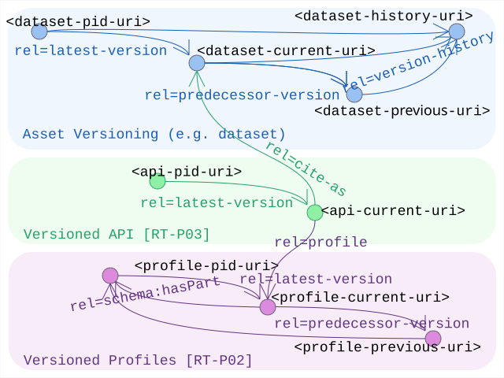

# Linkset Usage Pattern: Release Linking

## Pattern Name

[Release Linking][RT-P09]

## Goal

The objective of this pattern is to enable machine-actionable navigation through the lifecycle of a digital asset. By implementing standardized versioning relations, providers ensure that agents can autonomously discover the current state of a resource, its historical archive, and the specific permanent identifiers (PIDs) associated with individual releases.


## Motivation

In a dynamic data ecosystem, resources are continuously updated, but stability is required for scientific citation and automated processing. Key drivers for this pattern include:

* Contextual Currency: Without protocol-level signaling, a bot cannot know if the URI it has discovered is the most recent version, a one-of-a-kind first time perfect, a silently evolving system with little guarantees or an obsolete snapshot.
* Persistent Citation (The Series/Release Paradox): High-level resources often have a "Series DOI" (conceptual identity), while specific releases have "Release DOIs" (immutable snapshots). Machines must be able to bridge these identifiers.
* Profile Evolution: Just as datasets evolve, profiles (RT-P01) have releases. Agents need to "pin" their validation logic to a specific version of a profile while understanding its relationship to the abstract standard.
* Graceful Degradation: By linking a versioned profile back to its abstract parent, older clients can still interact with new releases by falling back to shared, version-agnostic affordances.

## Relation to other patterns

Being a pattern that is applicable to any digital asset, it lends itself logically to so called "pattern weaving", combinations of patterns applied simultanuously to some resources.
Specifically we want to mention:
* That subsetting APIs [RT-P05] are often versioned, and note that the datasets they rely on will evolve according to their own lifecycle. Each version of the one can simply link to the matching version of the other (through `rel=cite-as`). Following the chain of dependency, this will typically call for a new (dot) release of the API when it decides to switch to a new version of the backing dataset.
* That versioning of profiles should consider applying the `rel=http://schema.org/hasPart` link from [RT-P02] to allow inferring generic profile assumptions down to such specific releases.


## Encoding 

This uses [RFC 5829] (Versioning) in a straightforward and minimalistic way:
* Series-to-Latest: The Conceptual Series URI (the "latest" identity) SHOULD point to the current state using `rel=latest-version`.
* Series-to-History: The Series URI COULD provide a link to the complete archive using `rel=version-history` or `rel=timemap`.
* Chain of Succession: Releases SHOULD point to their immediate ancestors using `rel=predecessor-version`.


## Sketch

  
*Sketch of the linkset-usage-pattern for release linking* 


## Link Relations Used

| Relation Type | Specification | Technical Function | 
| :--- | :--- | :--- | 
| rel="latest-version" | RFC 5829 | Points from the conceptual series to the most recent, authoritative release. | 
| rel="version-history"| RFC 5829 | Points to a resource (like a Memento TimeMap) containing the full list of versions. | 
| rel="predecessor-version" | RFC 5829 | Links a release to the version immediately preceding it in the history. |

### Design Considerations: Profile "Lazy Pinning"

Following the semantic logic of [RT-P02], versioned profiles (e.g., an OGC WFS 2.2 profile) SHOULD include a rel="http://schema.org/hasPart" link to the abstract (timeless) variant of the profile. This allows an agent to discover the most specific version while inferring that the resource also conforms to the general guarantees of the abstract Profile.

## Implementation Example: MarineInfo Dataset Release 

In this example, MarineInfo.org manages Dataset 90. The conceptual URI points to the latest release, while the release itself anchors its identity via a DOI and points back to the series history.
Series Linkset (dataset-90.ls.json):

```json
{
  "linkset": [
    {
      "anchor": "https://marineinfo.org/id/dataset/90",
      "latest-version": [{ "href": "https://marineinfo.org/id/dataset/90/v2.1" }],
      "version-history": [{ "href": "https://marineinfo.org/id/dataset/90/history" }]
    }
  ]
}
```

Release Linkset (dataset-90-v2.1.ls.json):
```json
{
  "linkset": [
    {
      "anchor": "https://marineinfo.org/id/dataset/90/v2.1",
      "predecessor-version": [{ "href": "https://marineinfo.org/id/dataset/90/v2.0" }],
      "version-history": [{ "href": "https://marineinfo.org/id/dataset/90/history" }]
    }
  ]
}
```

Note that there are multiple competing formats out there to describe the 'history' (ie. the list of all known versions). This pattern does not inforce the use of any of these. 
However, conforming to the rest of this pattern work, we do:
* suggests to provide a profile conformity declaration ([RT-P01]) to guide consumers into how to parse the information
* just apply a simple linkset extension (adding keyword `version`) to complete this example


History Linkset (dataset/90/history)
```json
{
  "linkset": [
    {
      "anchor": "https://marineinfo.org/id/dataset/90/history",
      "item": [
        { 
          "href": "https://marineinfo.org/id/dataset/90/v1.0",
          "version": "1.0",
          "release-date": "2023-06-02",
          "title": "Initial release."
        }, {

        }, {
          "href": "https://marineinfo.org/id/dataset/90/v2.0",
          "version": "2.0",
          "release-date": "2025-02-06",
          "title": "updated release containing major change abc..." 
        }, {
          "href": "https://marineinfo.org/id/dataset/90/v2.1",
          "version": "2.1",
          "release-date": "2026-08-26",
          "title": "updated release containing xyz..." 
        }
      ]
    }
  ]
}
``` 


[RFC 5829]: https://www.rfc-editor.org/info/rfc5829                             "RFC 5829 Link Relation Types for Simple Version Navigation between Web Resources"
[RT-P01]: ./01-profile-declaration.md                                         "Profile Declaration"
[RT-P02]: ./02-profile-composition.md                                         "Profile Composition"
[RT-P05]: ./05-subsetting-api.md                                              "Subsetting API"
[RT-P09]: ./09-release-links.md                                               "Linking versions and releases"
